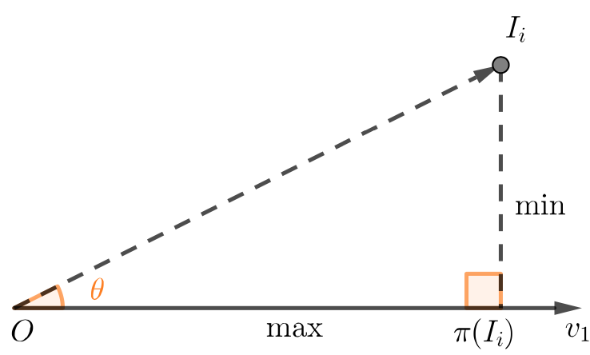
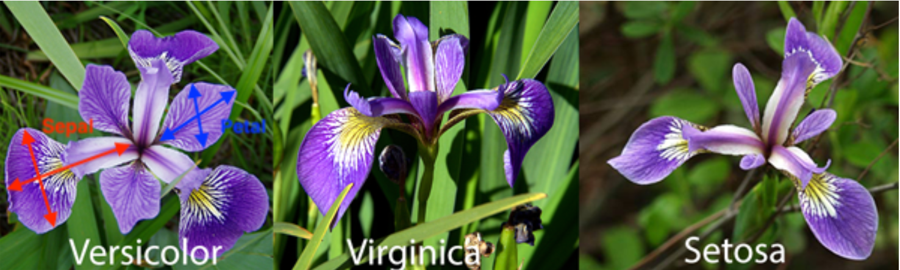
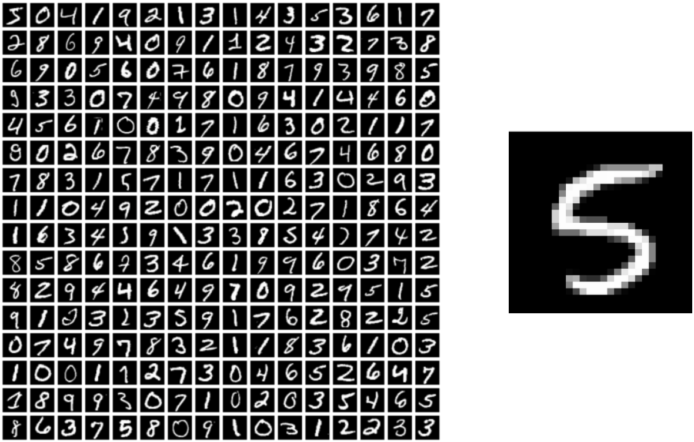

```{r setup, include=FALSE}
knitr::opts_chunk$set(echo = TRUE)
```

\tableofcontents
\newpage

```{r, echo=FALSE, message=FALSE}
# On n'oublie pas d'inclure le fichier csv que l'on étudie.
library(readr)
T <- read_delim("temperature.csv", ";", escape_double = FALSE)
```


# 1  Rappels

## 1.1  Principe général de l’ACP

Considérons un nuage $\mathcal{N}$ de *n* points dans un espace E de dimension *p*. Lorsque *E* est de dimension élevée, on ne peut pas visualiser l’espace de points. Un des buts de l’**analyse en composantes principales** (ACP) est alors de trouver le meilleur sous-espace H de E, de dimension h égale à 2 ou 3 par exemple, dans lequel on aura la meilleure représentation du nuage et que l’on pourra ainsi visualiser dans un plan en 2D ou espace 3D et déterminer alors la topologie des individus (proches vs éloignés).
L’ACP vise à trouver le sous-espace sur lequel le projeté de $\mathcal{N}$ aura la plus grande “dispersion”. Aussi, le principe de l’ACP répond simultanément aux deux objectifs suivants:

* Pour les individus   
L’objectif de la méthode ACP est de projeter les individus sur des axes appelés *axes factoriels* en conservant le mieux possible les distances entre individus. Cela revient à déformer le moins possible le nuage de points initial lorsqu’on le projette sur un axe ou un plan.

* Pour les variables   
On construit de nouvelles variables, appelées *composantes principales*, par combinaison linéaire des variables initiales et telles que ces nouvelles variables aient la plus grande variance possible. Cette variance est représentée par la *valeur propre* de l’axe. Enfin, on choisit les composantes principales les plus non corrélées de façon à ce que les axes de représentation dans le nouvel espace *H* soient les plus orthogonaux possibles.

```{r pressure, echo=FALSE, fig.cap="Quel est le meilleur axe ?", out.width = '75%', fig.align='center'}

```

## 1.2  Centrage et réduction

Notons $X$, la matrice représentant le nuage de points $\mathcal{N}$. Les lignes représentent les individus $I_{1} \leqslant j \leqslant p$ et les colonnes les variables $X_{1} \leqslant j \leqslant p$. On a:

$$X = 
   \begin{array}{c c}
    & \begin{array} {@{} c c c c c @{}}
      X_1 & \cdots & X_J & \cdots & X_p
    \end{array} \\
    \begin{array}{c}
      I_1 \\ \vdots \\ I_i\\ \vdots \\ I_n
    \end{array}\hspace{-1em} &
    \left(
      \begin{array}{@{} c c c c c @{}}
        X_{1,1}      & \cdots & X_{1,j} & \cdots & X_{1,p}\\ 
    \vdots & \ddots & \vdots & \vdots & \vdots \\ 
     X_{i,1}      & \cdots & X_{i,j} & \cdots & X_{i,p}\\ 
     \vdots  & \vdots & \vdots & \ddots & \vdots \\ 
     X_{n,1}      & \cdots & X_{n,j} & \cdots & X_{n,p}
      \end{array}
    \right) \\
  \end{array} \\
$$

La matrice centrée-réduite $\tilde{X}$ est obtenue telle que:

$$\tilde{X} =  \bar{X}. S^{-1}= 
  \begin{pmatrix}
    \frac{x_{1,1} - \bar{X}_{1}}{\sigma(X_{1})}  & \cdots & \frac{x_{1,p} - \bar{X}_{p}}{\sigma(X_{p})} \\ 
     \vdots    & \ddots & \vdots \\ 
    \frac{x_{1,n} - \bar{X}_{1}}{\sigma(X_{1})}      & \cdots & \frac{x_{1,n} - \bar{X}_{p}}{\sigma(X_{p})}
\end{pmatrix}
$$
Le choix de réduire ou non est un choix de modèle :

* si l’on ne réduit pas le nuage : une variable à forte variance va “tirer” tout l’effet de l’ACP à elle,

* si l’on réduit le nuage : une variable qui n’est qu’un bruit va se retrouver avec une variance apparente égale à une variable informative.

*Si les variables aléatoires sont dans des unités différentes, la réduction est obligatoire pour ne pas accorder un poids plus important à certaines variables.*

Pour centrer-réduire une matrice $X$, on utilise la commande scale:

`````{r, eval=FALSE}
X_tilde <- scale(X)
```

On peut convertir $X\_tilde$ en un dataframe à l’aide de la commande `as.data.frame`. Dans la suite du document, on considère que $X$ est centrée-réduite de sorte que:

$$
X\leftarrow\tilde{X}
$$

## 1.3  Sous-espace d’ajustement

Comme énoncé précédemment, l’ACP vise à trouver le sous-espace *H* qui résume au mieux les données de $\mathcal{N}$. Une analogie intéressante est celle d’une image pour résumer un objet. La qualité de restitution est jugée optimale si les critères suivants sont satisfaits:

* L’image restitue fidèlement la forme générale.

* On a la meilleure représentation de la diversité.

* Les distances entre individus sont préservées.

Ainsi, comment peut-on trouver la meilleure image, c’est-à-dire le meilleur sous-espace *H* pour représenter $\mathcal{N}$ ?
Pour cela, on cherche l’axe qui déforme le moins possible le nuage par projeté.
 
Par exemple, si l’on considère la figure 2, on cherche à minimiser la distance [au carré] entre l’individu $I_i$ et son projeté $\pi(I_i)$ sur l’axe engendré par le vecteur $\vec{v_1}$. Par le théorème de Pythagore, cela revient à maximiser la
i1 distance entre $O$ et $\pi(I_i)$.

```{r pressure1, echo=FALSE, fig.cap="Projeté orthogonal d’un point sur un axe factoriel", out.width = '55%', fig.align='center'}

```

Dès lors, l’objectif devient maximiser $\sum_{i}d(O, \pi(I_i))^2$.

Sans perte de généralités, notre exemple effectué ici sur un individu peut être appliqué sans peine dans le cas d’un ajustement d’une variable. On revient toujours à la recherche d’axes orthogonaux minimisant les distances des projetés sur ces axes. On montre d’ailleurs que l’étude des individus est équivalente à l’étude des variables.

Dans le cours, on démontre alors que $\vec{v_1}$ est le vecteur propre associé à la valeur propre $\lambda_1$ de la matrice symétrique $X.X^T$.

Un critère couramment utilisé est la mesure de dispersion (ou variabilité) d’un nuage de points que l’on appelle
aussi l’*inertie* et qui correspond, grosso modo, à la notation variance généralisée à plusieurs dimensions.
Ainsi, soit $(\lambda_1\geqslant...\geqslant\lambda_p)$ le spectre de la matrice symétrique $X.X^T$ , l’inertie de l’axe associé au vecteur $\vec{v_i}$ la valeur propre $\lambda_i$. On exprime souvent cette quantité relativement en pourcentage:
$$
\frac{\lambda_i}{\sum_{i}^{p}\lambda_i}
$$

\newpage
# 2  Aide à l’interprétation

Afin d’introduire le problème de l’ACP, nous utiliserons le fichier `temperature.csv` constitué de 15 villes de France et 12 températures mensuelles moyennes (sur 30 ans).

## 2.1  Valeurs propres $\lambda$ et choix des axes

Pour définir le nombre d’axes à retenir, on étudie les valeurs propres obtenues. Chaque valeur propre correspond à la part d’inertie projetée sur un axe donné.

On ne retient donc que les axes avec les plus fortes valeurs propres. Le choix des axes retenus est un peu délicat. On peut donner quelques règles :

* *Règle de l’inertie minimale* : On sélectionne les premiers axes jusqu’à atteindre un % donné d’inertie expliquée (80% par exemple).

* *Règle du coude* : On observe souvent de fortes valeurs propres au départ puis ensuite de faibles valeurs avec un décrochage dans le graphique des éboulis des valeurs propres (Scree plot). On retient alors les axes jusqu’à ce qu’on observe une chute brutale entre deux valeurs successives.

Sous R, on utilise les packages `FactorMineR` et `factoextra` dédiés à l’exploration et l’analyse en hautes dimensions pour appliquer une ACP.

La commande utilisée pour réaliser un modèle d’ACP sur une matrice *X* avec *h* dimensions est:
`PCA(X, ncp = h, graph = FALSE)`

L’option `graph` sera détaillée dans la suite du document. Par défaut, si `ncp` est négligée, *h* = 2.

```{r}
library("FactoMineR")
temp_scale <- as.data.frame(scale(T[, -1]))
rownames(temp_scale) <- T$Name
temp.pca <- PCA(temp_scale, graph = FALSE)
```

Les valeurs propres (i.e proportion de variances) retenues par les composantes principales peuvent être extraites à l’aide de la fonction `get_eigenvalue`:

```{r}
library("factoextra")
```

```{r}
eig.val <- get_eigenvalue(temp.pca)
round(eig.val,2) # Pour restreindre à 2 chiffres après la virgule
```

Pour observer le graphique des éboulis des valeurs propres, on utilise la commande:

```{r}
fviz_eig(temp.pca, addlabels = TRUE)
```

Sur ce graphique, on distingue clairement que la *première dimension explique une grande partie de l’information de notre nuage de points* (à hauteur de $79.7\%$).

En terme de variance cumulée, les deux premières dimensions expliquent $98.21\%$ de l’information de notre jeu de données ce qui est excellent.

## 2.2  Analyse des variables


### 2.2.1  Cercle des corrélations

Le cercle des corrélations est un cercle, de rayon 1 où l’axe des abscisses représente le premier axe factoriel selon $\vec{v_1}$ et l’axe des ordonnées le second axe.

```{r}
fviz_pca_var(temp.pca, repel = TRUE) # Évite les chevauchements
```

À l’intérieur du cercle, des flèches partent du centre. Elles sont plus ou moins grandes, et peuvent aller jusqu’à toucher le cercle, sans jamais le dépasser.

Le projeté sur l’axe des abscisses de la variable $X_j$ correspond à la corrélation entre $X_j$ et la composante principale $\vec{v_1}(Dim1)$. On a:
$$
\cos(\vec{X}_j)=\rho_{X_j,v_1}
$$
Le projeté sur l’axe des ordonnées donne la corrélation avec la composante principale $\vec{v_1}(Dim2)$.
$$
\sin(\vec{X}_j)=\rho_{X_j,v_2}
$$
Par exemple, on voit ici que toutes les variables sont très corrélées à l’axe factoriel engendré par $\vec{v_1}$. Toutes les flèches dépassent une valeur projetée de $0.75$ sur `Dim1`.

Les coordonnées précises des composantes principales s’obtiennent à l’aide de la commande:

```{r}
round(get_pca_var(temp.pca)$coord, 2)
```

Par exemple, On voit que $\vec{v_1}$ est formé par une combinaison linéaire des différentes variables initiales telle que:

$$
\vec{v_1} = 0.77\vec{Janv} + 0.89\vec{Fev} + 0.97\vec{Mars} + ... + 0.91\vec{Nov} + 0.78\vec{Dec}
$$

### 2.2.2  Qualité de représentation

Il n’est pas toujours simple d’interpréter le cercle des corrélations. Plusieurs choses à savoir pour ne pas faire d’erreurs:

* Il est préférable de n’interpréter uniquement que les variables avec une norme proche de 1.   
Une flèche qui est petite sur le premier plan factoriel signifie qu’elle est faiblement corrélée à la
première composante principale $\vec{v_1}$, et faiblement corrélée aussi à $\vec{v_2}$. Mais elle peut très bien l’être à $\vec{v_3}$,$\vec{v_4}$, etc.   
Pour s’assurer de la qualité de représentation d’une variable au sein d’un axe (ou plan) factoriel, on utilise la mesure du $\cos^2$.   
Soit une variable $X_j$ , la valeur $\cos^2$ pour l’axe factoriel engendré par $\vec{v_k}$ correspond à la valeur $\rho^2_{X_j,v_k}$.

$$
qlt(X_j,v_k)=\cos^2(\vec{X_j},\vec{v_k})=\rho^2_{X_j,v_k}
$$
Cette valeur peut aussi être interprêtée géométriquement. Elle est obtenue par la commande:

```{r}
round(get_pca_var(temp.pca)$cos2, 2)
```

* Concernant l’angle formé entre deux variables $X_i$ et $X_j$, le cosinus de celui-ci peut être interprété intuitivement comme la corrélation entre ces deux variables. Autrement dit, $\cos(\vec{X}_i,\vec{X}_j)\approx \rho_{X_i,X_j}$,   
*Mais attentions !* Le cercle des corrélations est une projection de l’espace des variables $\mathbb{R}^p$ dans le plan $\mathbb{R}^2$. En conséquence les angles sont déformés et cette interprétation n’est valable que si les variables $X_i$ et $X_j$ sont correctement représentées dans le plan factoriel (i.e. que la norme des variables est proche de 1). Pour connaitre la corrélation entre les variables, on fera plutôt *un corrélogramme* comme vu dans le TP1.

### 2.2.3  Contribution aux axes

La contribution d’une variable est la valeur relative d’implication de la variable dans la composante principale. Plus la valeur de contribution est forte, plus la variable contribue à la composante principale en question. La contribution `ctr` de la variable $X_j$ pour la composante principale $v_k$ est calculée telle que:

$$
ctr(X_j,v_k)=\frac{\rho_{X_j,v_k}}{\lambda_k}
$$

Sous hypothèse d’une loi uniforme, la contribution moyenne d’une variable est de $\frac{1}{p}$ . On peut visualiser le graphique des contributions des variables à l’axe *i* grace à la commande:  
`fviz_contrib(X.pca, choice = "var", axes = i)`

Pour les deux premiers axes, on a :

```{r,fig.show='hold', fig.align='left', out.width='.49\\linewidth'}
fviz_contrib(temp.pca, choice = "var", axes = 1)
fviz_contrib(temp.pca, choice = "var", axes = 2)
```

On voit grâce à ces graphiques que presque toutes les variables contribuent aux axes du plan factoriel. On note néanmoins que la variable *Aout* est la seule à contribuer légérement moins que la moyenne aux deux axes.

### 2.2.4  Interprétation des axes

Dans notre cas, on peut assumer que toutes les variables sont bien représentées par notre plan factoriel. Grâce à la contribution des variables sur les axes, on peut tenter d’interpréter chacun des deux axes:

* Pour l’axe factoriel engendré par $\vec{v}_1(Dim1)$. Toutes les variables semblent corrélées à celui-ci. On remarque néanmoins que les variables les plus fortement corrélées et contributives sont globalement celles des mois de Printemps (Mars, Avril) et Automne (Septembre, Octobre, Novembre). Cet axe peut-être interprété comme celui des **villes chaudes et froides**.

* Pour l’axe factoriel engendré par $\vec{v}_2(Dim2)$, es variables sont plus faiblement corrélées. Néanmoins, on remarque un effet de symétrie entre les mois “froids” de l’année (Octobre → Mars) et les mois “chauds” (Avril → Septembre). De même, les variables les plus contributives sont celles qui apportent les pics de températures: en hiver (Decembre, Janvier) et été (Juillet). Cet axe peut-être interprété comme l’**amplitude thermique** d’une ville durant l’année.

On peut confirmer nos hypothèses en créant les deux nouvelles variables suivantes:

```{r, warning=FALSE}
temp_scale$moyenne <- scale(apply(T[, 2:13], 1, mean))
temp_scale$amplitude <- scale(apply(T[, 2:13], 1, max) - apply(T[, 2:13], 1, min))
```

Lorsque l’on effectue une ACP, il est possible d’indiquer certaines variables descriptives avec l’option `quanti.sup` et `quali.sup` (en fonction de si les variables sont quantitatives ou qualitatives) Elles ne sont alors pas prises en compte lors de l’évaluation de l’ACP mais viennent éclairer certaines analyses:

```{r}
# On indique les numéros de colonnes
temp.pca <- PCA(temp_scale, graph = FALSE, quanti.sup = c(13,14))
fviz_pca_var(temp.pca, repel = TRUE)
```

On voit sur ce nouveau cercle que la variable moyenne est extrêmement corrélée à la $Dim1$. De même, la variable `amplitude` est fortement corrélée à $Dim2$ ce qui vient confirmer nos précédentes hypothèses.

## 2.3  Analyse des individus

Lorsque l’on retient uniquement les deux premières composantes principales, il est possible de représenter nos
individus dans le plan factoriel suivant $\vec{v}_1$ et $\vec{v}_2$. La commande utilisée est:

```{r}
fviz_pca_ind (temp.pca,
              repel = TRUE)
```

Cette projection vient confirmer notre analyse précédente du cercle des corrélations.

* On retrouve bien un clivage des villes selon l’axe $Dim1$, entre la gauche et la droite. Les villes à gauche peuvent être interprétées comme des villes à *climat frais* (Lilles, Strasbourg, Vichy). Alors que les villes à droite de l’axe sont des villes à *climat chaud* (Toulouse, Nice, Montpellier).

* De même, l’axe $Dim2$ semble effectivement représenter l’amplitude thermique des villes. Les villes en haut de l’axe (Brest) semblent adopter un *climat stable* entre les saisons. L’hiver est doux et l’été est frais. Les villes en bas de l’axe (Strasbourg, Lyon) sont caractérisées par un *climat à amplitude forte*, les hivers sont froids et les étés chauds.

De la même façon que lors de l’étude des variables, des mesures de qualité et de contribution peuvent être appliquées aux individus.

Soit un individu $I_i$ et un axe engendré par la composante principale $\vec{v}_k$, la qualité de représentation de $I_i$ correspond au $\cos^2$ entre le vecteur $(O,I)$ et la $\vec{v}_k$ :

$$
qlt(I_i,v_k)=\cos^2(\vec{I}_i,\vec{v}_k)=\frac{\pi(I_i,v_k)^2}{\sum_{k}\pi(I_i,v_k)^2}
$$
Où $\pi(I_i,v_k)$ représente la valeur de la coordonnée projetée de l’individu $I_i$ sur l’axe engendré par $\vec{v}_k$. Ces valeurs sont obtenues par la commande :

```{r}
round(get_pca_ind(temp.pca)$coord, 2)
```

La qualité de représentation de l’individu est obtenue par la commande :

```{r}
round(get_pca_ind(temp.pca)$cos2, 2)
```

Tous les individus sont très bien représentés $(> 90\%)$ par le plan factoriel. Si l’on constate des individus mal représentés, ils ne doivent pas être pris en compte dans l’analyse.

La contribution de l’individu $I_i$ à l’axe engendré par $\vec{v}_k$ est quant à elle calculée telle :

$$
ctr(I_i,v_k)=\frac{\pi(I_i,v_k)^2}{n \times \lambda_k}
$$
La contribution des individus pour l’axe *k* peut être visualisée à l’aide de la commande :  

`fviz_contrib(X.pca, choice = "ind", axes = k)`

On peut également affecter des variables explicatives aux individus. Par exemple, l’orientation géographique des villes.

```{r}
temp_scale$orientation <- c("SO", "NO", "SE", "SE", "NE", "SE", "SE", "SE", "NO", "SE",
                            "NO", "NO", "NE", "SO", "SE")
```

On ajoute l’orientation en tant que variable qualitative à l’ACP.

```{r}
library(RColorBrewer)
temp.pca <- PCA(temp_scale, graph = FALSE, quanti.sup = c(13,14), quali.sup = c(15))
fviz_pca_ind(temp.pca, 
             repel = TRUE,
             col.ind = temp_scale$orientation,
             palette = brewer.pal(n = 4, name = "Dark2"))
```

\newpage
# 3  Exercices


## 3.1  Les iris de Fischer

On considère le fichier `iris.csv` sur Celene répertoriant 150 individus fleurs d’iris. On donne la description suivante des colonnes :

Colonne            Description                Value
---------------   -----------------------   ----------------------------------
`sepal_length`      Longueur des sépales     Int
`sepal_width`       Largeur des sépales      Int
`petal_length`      Longueur des pétales     Int
`petal_width`       Largeur des pétales      Int
`species`           Espèce d’iris            {Versicolor, Virginica, Setosa}
---------------   -----------------------   ----------------------------------

1. Statistiques descriptives

```{r, echo=FALSE, message=FALSE}
library(readr)
I <- read_delim("iris.csv", ";", escape_double = FALSE)
```

```{r}
library("FactoMineR")
iris_scale <- scale(I[, -5])
rownames(iris_scale) <- I$Species
iris.pca <- PCA(iris_scale, graph = FALSE)
```

 (a) Proposer une analyse préliminaire par statistiques descriptives du jeu de données iris. Votre
analyse3 devra contenir notamment:

```{r pressure2, echo=FALSE, fig.cap="Les iris de Fischer", out.width = '55%', fig.align='center'}

```

* Distribution de chaque variable puis analyses synthétiques agrégées par espèce.

* Corrélation entre les variables

```{r, message=FALSE}
library(PerformanceAnalytics)
chart.Correlation(iris_scale, histogram=TRUE, pch="+")
```

 (b) Sur la base de ces analyses, quelles variables vous semblent pertinentes pour l’ACP ?

>_Pour savoir quelle variables est pertinente, il faut d'abord comprendre la signification du graphique si-dessus. Tout d'abord, la distribution de chaqu’une des variables est montré sur la diagonale, puis en bas de la diagonale, les scatter plots sont montrés avec la courbe de tendance et pour finir, en haut de la diagonale, les coefficients de corrélation et les niveaux de significativité (étoiles) sont montrés._

>_Chaque niveau de significativité est associé à un symbole :  
p-values(0, 0.001, 0.01, 0.05, 0.1, 1) <=> symboles("$***$", "$**$", "$*$", "$.$", " ")_

>_Nous pouvons donc dire grâce à cela que les variables les plus pertinentes pour l'ACP sont `sepal.lenght`, `petal.width` et `petal.lenght`._

2. Calculer les valeurs propres de la matrice des données iris. Combien d’axes proposez vous de retenir pour l’ACP ? Détaillez votre réponse.

```{r, message=FALSE}
library("factoextra")
eig.val <- get_eigenvalue(iris.pca)
round(eig.val,2)
```

>_Pour avoir une observation graphique :_

```{r}
fviz_eig(iris.pca, addlabels = TRUE)
```
>_Sur ce graphique, on distingue clairement que la première dimension explique une grande partie de l’information de notre nuage de points (à hauteur de $73\%$)._

>_En terme de variance cumulée, les deux premières dimensions expliquent $95.9\%$ de l’information de notre jeu de données ce qui est excellent._

3. Analyse des variables

  (a) Dresser le cercle des corrélations de l’ACP. Commentez la qualité de représentation et la contribution de chaque variable quant aux axes retenus.
  
```{r}
fviz_pca_var(iris.pca, repel = TRUE)
```

```{r}  
round(get_pca_var(iris.pca)$coord, 2)
```

  (b) Interpréter la signification des axes retenus. Vous pourrez vous aider de la contribution des variables aux axes factoriels.

```{r, fig.show='hold', fig.align='left', out.width='.49\\linewidth'}
fviz_contrib(iris.pca, choice = "var", axes = 1)
fviz_contrib(iris.pca, choice = "var", axes = 2)
```

>_On voit grâce à ces graphiques que presque toutes les variables contribuent aux axes du plan factoriel._

4. Analyse des individus

  (a) Présenter la projection des indivus dans le plan factoriel. Vous colorerez dans un premier temps les points en fonction de l’espèce d’iris.
  
```{r} 
fviz_pca_ind(iris.pca, label="none", habillage=iris$Species)+
  scale_color_brewer(palette="Dark2")
```
  
  (b) Colorer les individus en fonction de leur contribution aux axes factoriels. Que remarquez-vous ? Pouvez l’expliquer ?
  
```{r}
library(viridis)
fviz_pca_ind(iris.pca, col.ind="cos2", geom = "point") +
      scale_color_viridis(option = "viridis")
```
  
  (c) Commenter la qualité de représentation des individus.

>_La qualité de réprésentation des individus est bonne. En effet, nous pouvons constater visuellement leur contribution._

5. Apprentissage statistique

L’option `addEllipses=TRUE` de la fonction `fviz_pca_ind` permet de dessiner l’ellipse de confiance (covariance ellipse error) à $95\%$.

  (a) Sous quelle condition la définition d’ellipses de confiance est-elle valable ? Est-ce le cas selon vous-ici ? Pourquoi ?
  
```{r}
fviz_pca_ind(iris.pca, label="none", habillage=iris$Species,
             addEllipses=TRUE, ellipse.level=0.95) +
  scale_color_brewer(palette="Dark2") 
```

>_La définition d'éllipses de confiance est valable quand il y a des variables qualitatives._

>_Oui c'est le cas, car nous avons trois groupes de données._

>_Nous avons trois groupe de données l'ellipse de confiance nous permet de déterminer l'étendue de la variable._

  (b) Proposer un algorithme permettant de classifier automatiquement une nouvelle iris inconnue et ainsi déterminer son espèce. Vous évoquerez les limites de votre approche et possibilités pour pallier à ces effets.
  
>Pour classifier automatiquement une nouvelle iris, on peut utiliser l'agorithme kNN. Il existe de nomreux packages qui l'implémente comme par exemple `class`.Dans la table `iris`, nous avons cinq colonnes, ainsi la dernière colonne est une variable d'intérêt (setosa, versicolor, virginica), alors que les quatres autres sont les descripteurs dont on espère qu’ils sont prédictifs de la variable d’intérêt.  
Supposons que nous ayons un nouvel iris dont on voudrait conaître l’espèce automatiquement. Nous allons chercher les iris les plus ressemblants d’après les informations dont nous disposons. Pour cela, nous calculons la distance euclidienne entre cette nouvelle iris et celle du data.frame `iris`. Après, nous cherchons les k plus proches voisins, c’est à dire les numéros des iris dont les distances à notre nouvelle iris sont les k plus petites. Quand cela est calculé, il faut ensuite  trouver l’espèce (variable `species`) de chaque voisin et déterminer l'espéce majoritaire._

>_On peut schématiser le fonctionnement de K-NN en l’écrivant en pseudo-code suivant :  
Données en entrée :un ensemble de données $E$, une fonction de définition distance $d$, un nombre entier $K$.  
Pour une nouvelle observation $X$ dont on veut prédire sa variable de sortie $y$ Faire :  
Calculer toutes les distances de cette observation $X$ avec les autres observations du jeu de données $E$  Retenir les $K$ observations du jeu de données $E$ les proches de $X$ en utilisation le fonction de calcul de distance $d$  
Prendre les valeurs de $y$ des $K$ observations retenues : calculer le mode de $y$ retenues  
Retourner la valeur calculée dans l’étape 3 comme étant la valeur qui a été prédite par kNN pour l’observation $X$_

>_Les limites de cet algorithme :  
kNN est un algorithme assez simple à appréhender. Principalement, grâce au fait qu’il n’a pas besoin de modèle pour pouvoir effectuer une prédiction. Le contre coût est qu’il doit garder en mémoire l’ensemble des observations pour pouvoir effectuer sa prédiction. Ainsi il faut faire attention à la taille du jeu d’entrainement. Egalement, le choix de la méthode de calcul de la distance ainsi que le nombre de voisins $k$ peut ne pas être évident. Il faut essayer plusieurs combinaisons et faire du tuning de l’algorithme pour avoir un résultat satisfaisant._

6. Reprendre l’analyse du jeu de données iris mais en effectuant ici une ACP **non réduite**. On appliquera pour ça l’option `scale = FALSE` lors de l’exécution de la fonction `PCA`.

Que remarquez vous ? Quelle méthode semble finalement donner les meilleurs résultats ici ? Expliquer ces résultats.

```{r}
irisSF.pca <- PCA(iris_scale, graph = FALSE, scale=FALSE)
```

```{r, message=FALSE}
library("factoextra")
eig.val <- get_eigenvalue(irisSF.pca)
round(eig.val,2)
```

```{r}
fviz_eig(irisSF.pca, addlabels = TRUE)
```

```{r}
fviz_pca_var(iris.pca, repel = TRUE)
```

```{r, fig.show='hold', fig.align='left', out.width='.49\\linewidth'}
fviz_contrib(irisSF.pca, choice = "var", axes = 1)
fviz_contrib(irisSF.pca, choice = "var", axes = 2)
```
```{r} 
fviz_pca_ind(irisSF.pca, label="none", habillage=iris$Species)+
  scale_color_brewer(palette="Dark2")
```

```{r}
library(viridis)
fviz_pca_ind(irisSF.pca, col.ind="cos2", geom = "point") +
      scale_color_viridis(option = "viridis")
```

```{r}
fviz_pca_ind(irisSF.pca, label="none", habillage=iris$Species,
             addEllipses=TRUE, ellipse.level=0.95) +
  scale_color_brewer(palette="Dark2") 
```

>_Cela ne change quasiement rien par rapport à l'ACP réduite. La méthode qui semble la meilleur est celle de l'ACP réduite._


## 3.2  Sommeil des mammifères

On considère le fichier `sleep.csv` sur Celene répertoriant les données de 70 espèces de mammifères concernant leur sommeil et quelques autres caractéristiques. On donne la description suivante des colonnes :

Colonne                       Description                Value
--------------------   -------------------------------------------------------------------- ------------
`name`                   Nom français vernaculaire de l’animal                                String
`genus`                  Genre, subdivion de la classification biologique                     String
`vore`                   Régime alimentaire de l’animal                                       String
`order`                  Ordre, subdivion de la classification biologique                     String
`sleep_total`            Durée (en h) de sommeil sur une journée                              Double
`sleep_rem`              Durée (en h) de sommeil paradoxal                                    Double
`awake`                  Durée (en h) où l’animal est éveillé                                 Double
`brain_wt`               Masse (en kg) moyenne du cerveau de l’animal                         Double
`body_wt`                Masse (en kg) totale moyenne de l’animal                             Double
`brain_body_ratio`       Ratio masse cerveau, masse totale $\frac{brain\_wt}{body\_wt}$       Double
`gest_day`               Période de gestation moyenne de l’animal                             Int
--------------------   -------------------------------------------------------------------- ------------

1. Statistiques descriptives

  (a) Proposer une analyse préliminaire par statistiques descriptives du jeu de données sleep. Votre analyse devra contenir notamment :
  
* Distribution de chaque variable puis analyses synthétiques agrégées selon différentes variables qualitatives.

* Corrélation entre les variables.

```{r, echo=FALSE, message=FALSE}
library("FactoMineR")
sleep <- read_delim("sleep.csv", ";", escape_double = FALSE)
sleep_scale <- as.data.frame(scale(sleep[, 5:11]))
rownames(sleep_scale) <- sleep$name
``` 

```{r}
#Distribution de chaque variable
summary(sleep) #[,5:11] pour les variables quantitatives seules
```

```{r, message=FALSE}
library(corrplot)
mcor <- cor(sleep_scale, use = "complete.obs")
corrplot(mcor, type="upper", order="hclust", tl.col="black", tl.srt=45)
mcor
```

```{r, message=FALSE}
library(PerformanceAnalytics)
chart.Correlation(sleep_scale, histogram=TRUE, pch="+")
```
  
2. On propose de compléter les données manquantes de la colonne `sleep_rem` en utilisant une technique de regression par *la méthode des moindres carrés*. Quelle valeur est estimée pour l’individu *Lamantin* ? Compléter les valeurs manquantes.

```{r}
library(missMDA)
data(sleep_scale)
nb = estim_ncpPCA(sleep_scale,scale=TRUE)
sleep.comp = imputePCA(sleep_scale,ncp=nb$ncp, scale = TRUE)
sleep.pca = PCA(sleep.comp$completeObs, graph = FALSE) 
```

```{r}
sleep.pca$ind
```

3. Calculer les valeurs propres de la matrice des données `sleep`. Combien d’axes proposez vous de retenir pour l’ACP ? Détaillez votre réponse.

```{r}
library("factoextra")
eig.val <- get_eigenvalue(sleep.pca)
round(eig.val,2)
```

>_Pour avoir une observation graphique :  _

```{r}
fviz_eig(sleep.pca, addlabels = TRUE)
```

>_Sur ce graphique, on distingue clairement que la première dimension explique une grande partie de l’information de notre nuage de points (à hauteur de $59.9%)_

>_En terme de variance cumulée, les trois premières dimensions expliquent $92% de l’information de notre jeu de données (ce qui est excellent)._


4. Analyse des variables

  (a) Commentez la qualité de représentation et la contribution de chaque variable quant aux axes retenus.
  
```{r}
fviz_pca_var(sleep.pca, repel = TRUE)
```

```{r}  
round(get_pca_var(sleep.pca)$coord, 2)
```

  (b) Interpréter la signification des axes retenus. Vous pourrez vous aider de la contribution des variables aux axes factoriels.
  
```{r, fig.show='hold', fig.align='left', out.width='.49\\linewidth'}
fviz_contrib(sleep.pca, choice = "var", axes = 1)
fviz_contrib(sleep.pca, choice = "var", axes = 2)
fviz_contrib(sleep.pca, choice = "var", axes = 3)
```

>_On voit grâce à ces graphiques que presque toutes les variables contribuent aux axes du plan factoriel._
  
5. Analyse des individus

  (a) Présenter la projection des indivus dans l’espace factoriel retenu. Vous colorerez dans un premier temps les points en fonction de la variable explicative retenue.
  
```{r, warning=FALSE} 
library(FactoMineR)
library(factoextra)
fviz_pca_ind(sleep.pca, label="none", habillage=as.factor(sleep$vore))
```
  
  Pour une projection 3D, on utilisera la commande `plot_ly(df, x = ~Dim.1, y = ~Dim.2, z = ~Dim.3)` de la librairie `plotly` où `df` est votre dataframe des coordonnées des individus et `Dim.k`, la colonne des coordonnées sur l’axe *k*.
  
  (b) Colorer les individus en fonction de leur qualité de réprésentation aux axes factoriels puis en fonction de la contribution. Commentez ces résultats.
  
```{r}
library(viridis)
fviz_pca_ind(sleep.pca, col.ind="cos2", geom = "point") +
      scale_color_viridis(option = "viridis")
```


## 3.3  Classiffication de caractères manuscrits

On considère le fichier `mnist.csv` sur Celene. Ces données proviennent de la base MNIST sur laquelle des milliers de chercheurs ont travaillé. Elle est constituée initialement de $70.000$ chiffres manuscrits au format $28$ pixels par $28$ pixels où chaque pixel est représenté par un niveau de gris allant de $0$ à $255$. Un chiffre manuscrit est vu comme un vecteur de $\{0, ..., 255\}28×28$.

```{r pressure3, echo=FALSE, fig.cap="Exemple de caractères manuscrits. Le caractère manuscrit à droite fait partie de la classe ‘5’", out.width = '45%', fig.align='center'}

```

Pour limiter le temps de calcul et la mémoire nécessaire, nous ne considérons que les $20.000$ premiers chiffres manuscrits de la base originale. On donne la description des colonnes suivantes:

* chaque ligne correspond à un chiffre manuscrit.

* la première colonne contient la *classe* (ou label) du caractère, c’est-à-dire le chiffre qu’il représente.

* les colonnes suivantes, contiennent les valeurs des $28 \times 28 = 784$ pixels de l’image en commençant par le coin supérieur gauche et parcourant l’image ligne par ligne.

On donne la fonction de visualisation suivante :

```{r}
img <- function(data, row_index){
    r <- as.numeric(data[row_index, 2:785])
    im <- matrix(nrow = 28, ncol = 28)
    j <- 1
    for(i in 28:1){
        im[,i] <- r[j:(j+27)]
        j <- j+28 
    }
    png(file = "out.png", width = 210, height = 300)
    image(x = 1:28,
          y = 1:28,
          z = im,
          col=gray((0:255)/255),
          main = paste("Number:", data[row_index, 1]))
    dev.off() 
}
```

```{r, echo=FALSE, message=FALSE}
library(readr)
mnist <- read_delim("mnist.csv", ";", escape_double = FALSE)
```

L’appel `img(mnist, i)` retourne la figure correspondant au caractère manuscrit ligne *i*.

1. Statistiques descriptives

  (a) Proposer une analyse préliminaire par statistiques descriptives du jeu de données `mnist`. Votre analyse devra contenir notamment :

* Nombre de caractères de chaque classe.

* Des premiers indicateurs sur la proportion de gris par pixel, puis agrégé par classe de caractère.

```{r}
count <- table(unlist(mnist[1]))
count
```


>_Il y a 10 classes de 0 à 9. Le résultat ci-dessus montre le nombre de valeurs pour chaque classe._

```{r, echo=FALSE}
res <- apply(mnist[-1], 1, sum)
res <- data.frame(mnist[,1], res)
res <- aggregate(res[,-1], by=list(res[,1]), FUN=mean)
colnames(res) <- c("label","pixel")
res$pixel <- ifelse(res$pixel, res$pixel/255, res$pixel/255)
res
```
>_Ci-dessus la proportion de gris par classe_

  (b) Sur la base de ces analyses, certaines zones de l’image vous semblent t-elles plus pertinentes pour l’analyse ? Lesquelles ? Pourquoi ?
  
>_Les zones de l'image les plus perninente sont les changements entre le fond et le nombre. En effet, il y aura un changement rapide de pixel à la bordure du nombre et du fond._
  
2. Classification par l’algorithme des *k* plus proches voisins (kNN).

L’algorithme des *k* proches voisins (*k*-Nearest Neightbors) est une méthode de prédiction qui, pour une base de données d’apprentissage, cherche à déterminer la classe d’une donnée inconnue. On donne l’algorithme en pseudo-code suivant :

**Algorithm 1:** *k*-Nearest Neightbors            
------------------------------------------------------------------------------------------------------ ---
**Result:** $Classify(X,Y,x)$
**Input :** **X**, l’ensemble d’apprentissage,
            **Y**, classe des données de **X**,
            *x*, une nouvelle donnée à classifier,
            *k*, nombre de voisins considérés
**Output:** Classe prédite pour *x*
**1 for** $i\in\left[1,|X|\right]$ **do**
**2** | Calcul de la distance euclidienne $\|X_i-x\|^2$
**3 end**
**4** Calcul de l’ensemble *I* contenant les indices des *k* plus petites distances $\|X_i-x\|^2$
**5 return** Classe majoritaire pour $\{Y_i|i\in I\}$
------------------------------------------------------------------------------------------------------ ---

L’idée générale de cet algorithme est très simple. Pour une nouvelle donnée d’entrée *x*, on évalue sa distance à toutes les autres données connues de notre base d’apprentissage **X**.

On rappelle que la distance euclidienne entre deux éléments $x, y \in \mathbb{R}^p$ est définie telle que :

$$
\|x-y\|=\sqrt{\sum_{i=2}^{p}(x_i-y_i)^2}
$$
On retient ensuite uniquement les k voisins $X_i$ les plus proches de *x*. On regarde alors les classes $Y_i$ de ces données $X_i$, puis on prédit la classe la plus présente. Par défaut on utilisera $k = 1$.

  (a) En assumant que **X** est doté de n individus définis dans un espace de dimension *p*. Quelle est
la complexité de l’algorithme des *k*-Nearest Neightbors pour $k = 1$.

>_La compléxité de *k*-Nearest Neightbors est quasi-linéaire. C'est à dire $0(nlog(n))$_

 (b) Diviser le jeu de données mnist en deux ensembles :
 
* Un ensemble d’apprentissage (train set) qui contiendra $80\%$ du jeu initial.

* Un ensemble test (test set) qui contiendra le reste des données.

On veillera à conserver les labels des deux ensembles dans un vecteur à part.

```{r}
samp_size <- floor(0.80* nrow(mnist))
train_ind <- sample(seq_len(nrow(mnist)), size = samp_size)

X_train <- as.data.frame(mnist[train_ind,])
X_test <- as.data.frame(mnist[-train_ind,])
```

  (c) La commande `knn` du package `class` permet de réaliser une classification à l’aide de l’algorithme des *k*-Nearest Neightbors:
  
```{r, eval=FALSE}
library(class)
knn(X_train, X_test, cl = Y_train_label, k = nb_neightbors)
```

Appliquer l’algorithme kNN (avec $k = 1$) sur votre ensemble d’apprentissage et de test. On veillera à sauvegarder le résultat de la fonction dans une variable `prediction` :  
`prediction <- knn(...)`

Donner le temps d’exécution de l’algorithme.

```{r, eval=FALSE}
library(class)
ptm <- proc.time()
predicition <- knn(X_train, X_test, cl = X_train$label, k = 1)
proc.time() - ptm
```

  (d) La commande `table(prediction, Y_test_label)` permet de dresser la *matrice de confusion C* de la classification effectuée. Le nombre $c_{ij}$ représente le nombre d’éléments de la classe *i* classifiés en tant que *j*.

```{r, eval=FALSE}
C <- table(prediction, Y_test_label)
```
  
  Quel est le pourcentage de caractères manuscrits de l’ensemble de test qui ont été mal classés ? Cet algorithme vous semble t-il efficace ? Quel critique peut-on lui faire ?
  
  (e) Pour chaque classe, identifier un exemple de caractère mal classé par l’algorithme. Vous illustrerez ces caractères à l’aide de la fonction `img` donnée plus haut et ferez figurer la classe prédite et réelle des caractères.
  
```{r, eval=FALSE}
# Create an index vector for misclassified examples
misclassified_indices <- which(prediction != Y_test_label)
# Loop through each class and find a misclassified example for that class
for (class_label in unique(Y_test_label)) {
  # Find the index of a misclassified example for this class
  misclassified_index <- misclassified_indices[Y_test_label[misclassified_indices] == class_label][1]
  # Extract the misclassified example data
  misclassified_example <- df[misclassified_index, -1]  # Assuming the first column is not needed for plotting
  # Get the predicted and actual labels
  predicted_label <- prediction[misclassified_index]
  actual_label <- Y_test_label[misclassified_index]
  # Plot the misclassified character using the 'img' function
  img(misclassified_example)
  # Print the predicted and actual labels
  print("Predicted Label:", predicted_label, "\n"))
  print("Actual Label:", actual_label, "\n\n"))
}
```
  
3. Prétraitement-compression des données par ACP

  (a) Effectuer une ACP du jeu `mnist` et analyser la série des valeurs propres. Combien de composantes doivent être conservées pour avoir plus de $95\%$ de l’inertie.

```{r, eval=FALSE}
# Perform PCA
pca <- prcomp(mnist[, -1], center = TRUE, scale = TRUE)
# Calculate the proportion of variance explained by each component
variance_explained <- pca$sdev^2 / sum(pca$sdev^2)
# Find the number of components needed to capture more than 95% of the variance
cumulative_variance <- cumsum(variance_explained)
num_components <- which(cumulative_variance >= 0.95)[1]
print("Number of components to capture more than 95% of variance:", num_components, "\n")
```

  (b) Appliquer à nouveau l’algorithme kNN mais ici vous utiliserez comme jeu initial la projection via ACP réalisée à la question précédente. Que constatez-vous ?
  
```{r, eval=FALSE}
# Use the 'num_components' found in part (a) to retain the top components
reduced_mnist <- pca$x[, 1:num_components]

# Assuming you have 'X_train' and 'X_test' as your training and test sets

# Apply kNN algorithm on the reduced dataset
prediction_pca <- knn(reduced_mnist[train_indices, ], reduced_mnist[test_indices, ], cl = Y_train_label, k = 1)
# Calculate accuracy or other evaluation metrics
accuracy_pca <- sum(prediction_pca == Y_test_label) / length(Y_test_label)
print("Accuracy with PCA:", accuracy_pca, "\n")
```
  
  (c) Dresser la nouvelle matrice de confusion à l’issu de la classification précédente. Comparer ces résultats avec la matrice de la question 2. (d). Que peut-on dire ?
  
```{r, eval=FALSE}
confusion_matrix_pca <- table(prediction_pca, Y_test_label)
```
